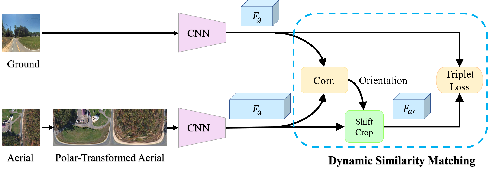

# Beyond Cross-view Image Retrieval: Highly Accurate Vehicle Localization Using Satellite Image, CVPR 2022

# Abstract
This paper addresses the problem of vehicle-mounted {\em camera localization} by matching a ground-level image with an overhead-view satellite map.  Existing methods often treat this problem as cross-view {\em image retrieval}, and use learned deep features to match the ground-level query image to a partition (\eg, a small patch) of the satellite map. By these methods, the localization accuracy is limited by the partitioning density of the satellite map (often in the order of tens meters).  Departing from the conventional wisdom of image retrieval, this paper presents a novel solution that can achieve highly-accurate localization. The key idea is to formulate the task as pose estimation and solve it by neural-net based optimization. Specifically, we design a two-branch {CNN} to extract robust features from the ground and satellite images, respectively. To bridge the vast cross-view domain gap, we resort to a Geometry Projection module that projects features from the satellite map to the ground-view, based on a relative camera pose. Aiming to minimize the differences between the projected features and the observed features, we employ a differentiable Levenberg-Marquardt ({LM}) module to search for the optimal camera pose iteratively. The entire pipeline is differentiable and runs end-to-end. 
Extensive experiments on standard autonomous vehicle localization datasets have confirmed the superiority of the proposed method. Notably, \eg, starting from a coarse estimate of camera location within a wide region of $40\text{m}\times40\text{m}$, with an 80\% likelihood our method quickly reduces the lateral location error to be within $5\text{m}$ on a new KITTI cross-view dataset.
### Experiment Dataset
We use two existing dataset to do the experiments: KITTI and Ford-AV. For our collected satellite images for both datasets, please first fill this [Google Form](https://forms.gle/Bm8jNLiUxFeQejix7), we will then send you the link for download. 

- KITTI: Please first download the raw data (ground images) from http://www.cvlibs.net/datasets/kitti/raw_data.php, and store them according to different date (not category). 
Your dataset folder structure should be like: 

KITTI:

  raw_data:
  
    2011_09_26:
    
      2011_09_26_drive_0001_sync:
      
        image_00:
	
	image_01:
	
	image_02:
	
	image_03:
	
	oxts:
	
      ...
      
    2011_09_28:
    
    2011_09_29:
    
    2011_09_30:
    
    2011_10_03:
  
  satmap:
  
    2011_09_26:
    
    2011_09_29:
    
    2011_09_30:
    
    2011_10_03:

- Ford-AV: The ground images and camera calibration files can be accessed from https://avdata.ford.com/downloads/default.aspx. Please follow their original structure to save them on your computer. For the satellite images, please put them under their corresponding log folder. Here is an example:

Ford:

  2017-08-04:
  
    V2:
    
      Log1:
      
        2017-08-04-V2-Log1-FL
	
        SatelliteMaps_18:
	
        grd_sat_quaternion_latlon.txt
	
        grd_sat_quaternion_latlon_test.txt

  2017-10-26:
  
  Calibration-V2:

### Codes
Codes for training and testing on unknown orientation (train_grd_noise=360) and different FoV.

1. Training:

    python train_kitti.py --batch_size 1 --train_damping 0 --using_weight 0
    
    python train_kitti.py --batch_size 1 --train_damping 0 --using_weight 0

    python train_ford.py --batch_size 1 --train_log_start 0 --train_log_end 1 --train_damping 0 --using_weight 0
    
    python train_ford.py --batch_size 1 --train_log_start 1 --train_log_end 2 --train_damping 0 --using_weight 0
    
    python train_ford.py --batch_size 1 --train_log_start 2 --train_log_end 3 --train_damping 0 --using_weight 0
    
    python train_ford.py --batch_size 1 --train_log_start 3 --train_log_end 4 --train_damping 0 --using_weight 0
    
    python train_ford.py --batch_size 1 --train_log_start 4 --train_log_end 5 --train_damping 0 --using_weight 0
    
    python train_ford.py --batch_size 1 --train_log_start 5 --train_log_end 6 --train_damping 0 --using_weight 0

2. Evaluation:

    python train_kitti.py --batch_size 1 --train_damping 0 --using_weight 0 --test 1
    
    python train_kitti.py --batch_size 1 --train_damping 0 --using_weight 0 --test 1
    
    
    python train_ford.py --batch_size 1 --train_log_start 0 --train_log_end 1 --train_damping 0 --using_weight 0 --test 1
    
    python train_ford.py --batch_size 1 --train_log_start 1 --train_log_end 2 --train_damping 0 --using_weight 0 --test 1
    
    python train_ford.py --batch_size 1 --train_log_start 2 --train_log_end 3 --train_damping 0 --using_weight 0 --test 1
    
    python train_ford.py --batch_size 1 --train_log_start 3 --train_log_end 4 --train_damping 0 --using_weight 0 --test 1
    
    python train_ford.py --batch_size 1 --train_log_start 4 --train_log_end 5 --train_damping 0 --using_weight 0 --test 1
    
    python train_ford.py --batch_size 1 --train_log_start 5 --train_log_end 6 --train_damping 0 --using_weight 0 --test 1

You are free to change batch size according to your own GPU memory. 

### Models:
Our trained models for Ford and KITTI are available [here](https://anu365-my.sharepoint.com/:f:/g/personal/u6293587_anu_edu_au/Ev7HAgSDze5LhvRWfcM4AgEBJiSr6W0GuTEEfdhWHG_gSQ?e=vNtwCJ). 

### Publications
This work is published in CVPR 2022.  
[Beyond Cross-view Image Retrieval: Highly Accurate Vehicle Localization Using Satellite Image]

If you are interested in our work and use our code, we are pleased that you can cite the following publication:  

*Yujiao Shi, and Hongdong Li. Beyond Cross-view Image Retrieval: Highly Accurate Vehicle Localization Using Satellite Image.*

@inproceedings{shi2020beyond,
  title={Beyond Cross-view Image Retrieval: Highly Accurate Vehicle Localization Using Satellite Image},
  author={Shi, Yujiao and Li, Hongdong},
  booktitle={Proceedings of the IEEE Conference on Computer Vision and Pattern Recognition},
  year={2022}
}

